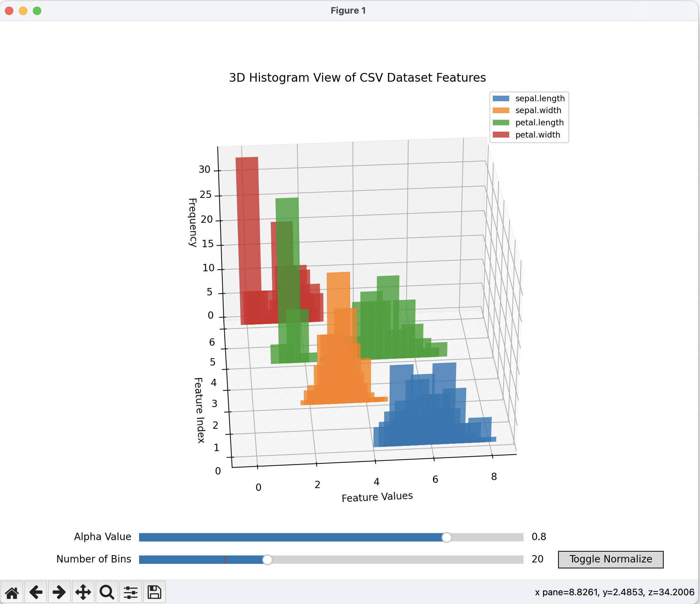

# 3D-Histo

Multidimensional visualization of data histograms with interactive features.



## Features

- 3D Histogram View of CSV Dataset Features
- Min-Max Normalization Toggle
- Bin Size Adjustment Slider

## Installation

```bash
pip install -r requirements.txt
```

## Libraries Used

- pandas
- matplotlib
- numpy
- tkinter

## License

This project is licensed under the MIT License. See the `LICENSE` file for more details.
